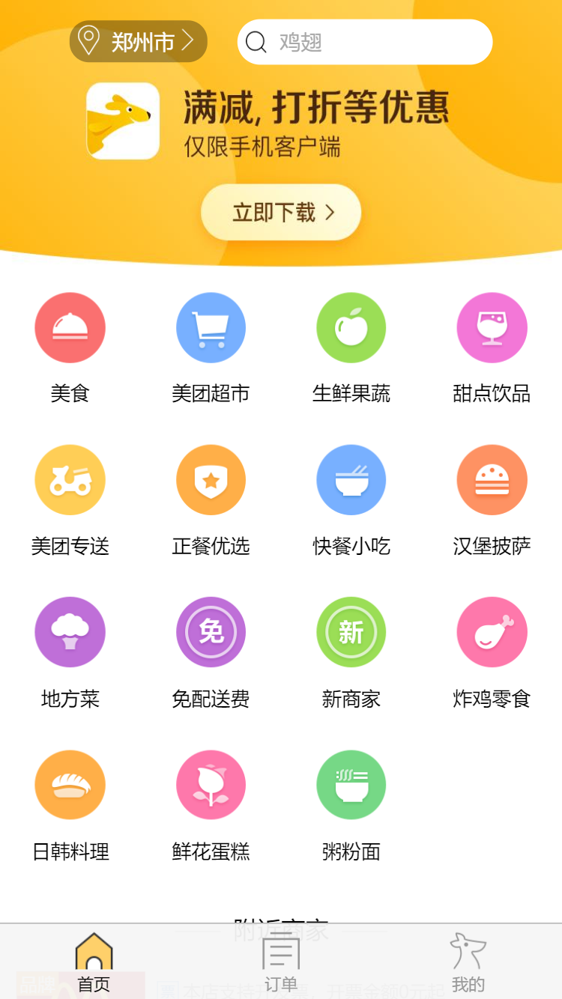
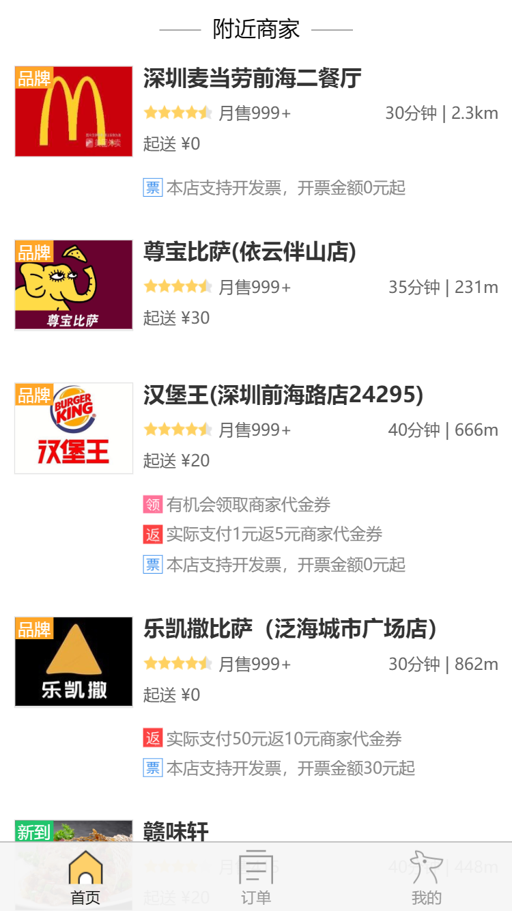
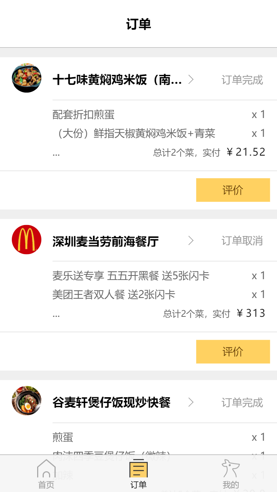
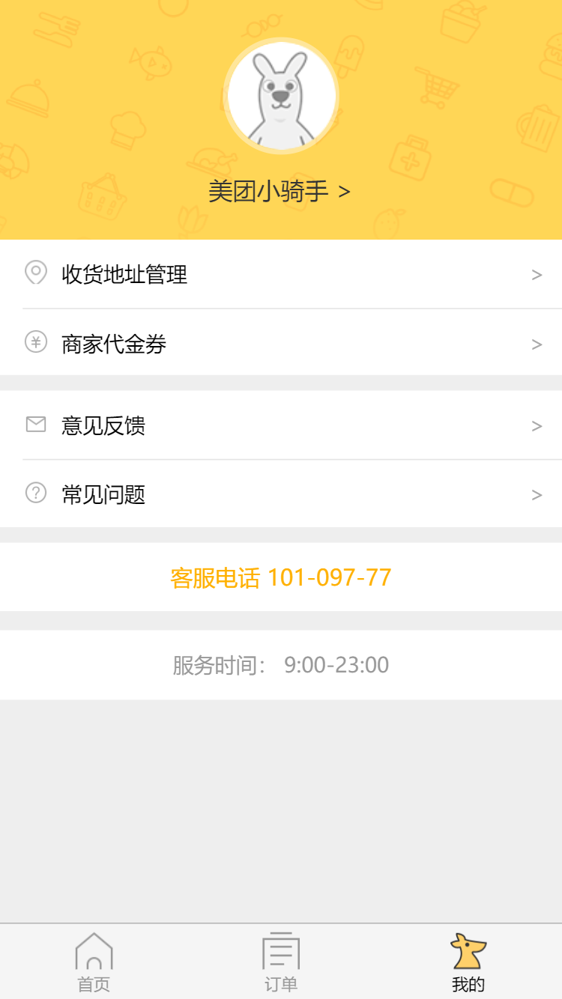
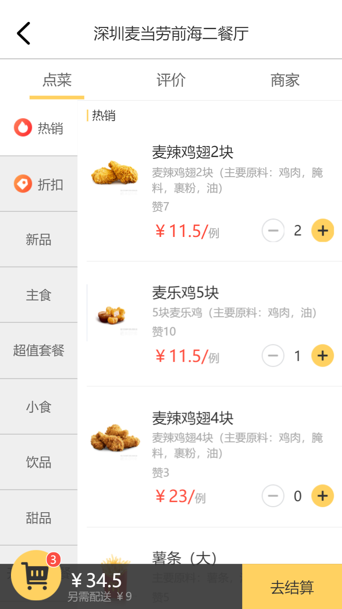
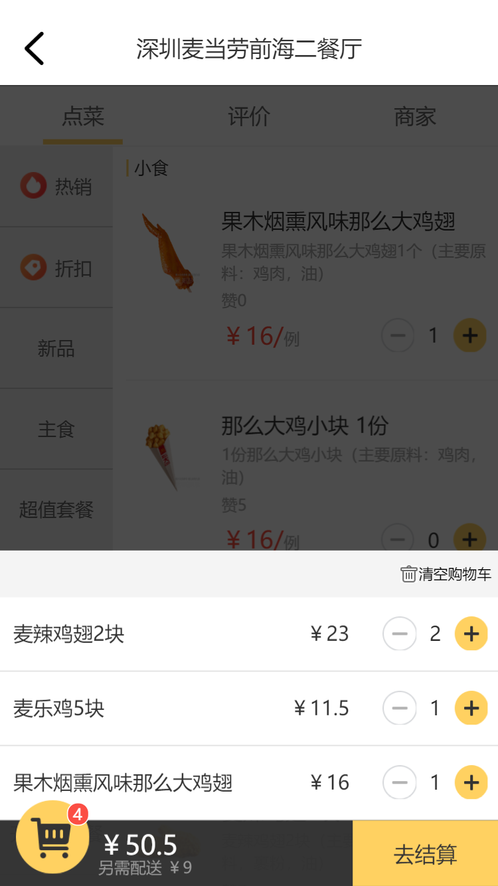

## 前言
此项目是在学习基础知识时用来练手的一个项目，主要是为了进一步了解掌握原生js和jQuery库的应用。


## 技术栈

HTML + CSS + JavaScript + jQuery

## 项目运行

**注：此项目需要放到服务器环境下运行**
```
git clone https://github.com/wwwyyying/MeiTuan-jQuery.git

//浏览器中输入 localhost:80/MeiTuan-jQuery/index/index.html
```

## 项目截图

**首页**




**订单页**



**我的页**



**点菜页**



**购物车**



## 项目布局

```
|-- MeiTuan-jQuery
    |-- README.md
    |-- common                                      // 公共组件
    |   |-- bottomBar                               // 底部工具栏组件
    |   |   |-- bottomBar.css
    |   |   |-- bottomBar.js
    |   |   |-- img
    |   |       |-- .DS_Store
    |   |       |-- homeIcon.png
    |   |       |-- homeIconActive.png
    |   |       |-- myIcon.png
    |   |       |-- myIconActive.png
    |   |       |-- orderIcon.png
    |   |       |-- orderIconActive.png
    |   |-- headerTab                               // 顶部选项卡组件
    |   |   |-- headerTab.css
    |   |   |-- headerTab.js
    |   |-- navHeader                               // 顶部导航组件
    |       |-- navHeader.css
    |       |-- img
    |           |-- back.png
    |-- index                                       // 首页
    |   |-- index.html                              // 入口html文件
    |   |-- category                                // 中上部类别列表组件
    |   |   |-- category.css
    |   |   |-- category.js
    |   |-- contentList                             // 中下部商家列表组件
    |   |   |-- contentList.css
    |   |   |-- contentList.js
    |   |-- header
    |   |   |-- header.css
    |   |-- img
    |   |   |-- arrowIcon.png
    |   |   |-- locationIcon.png
    |   |   |-- searchIcon.png
    |   |-- searchBar                               // 搜索框样式
    |   |   |-- searchBar.css
    |   |-- starScore                               // 五星评论组件
    |       |-- starScore.css
    |       |-- starScore.js
    |       |-- img
    |           |-- fullstar.png
    |           |-- gray-star.png
    |           |-- halfstar.png
    |-- json                                        // 数据文件
    |   |-- comments.json
    |   |-- evadata.json
    |   |-- filter.json
    |   |-- food.json
    |   |-- head.json
    |   |-- homelist.json
    |   |-- listparams.json
    |   |-- orders.json
    |   |-- restuarant.json
    |-- lib                                         // 工具库文件
    |   |-- jquery.min.js
    |   |-- reset.css
    |-- menu                                        // 点菜页
    |   |-- menu.html
    |   |-- left                                    // 左侧菜品类别组件
    |   |   |-- left.css
    |   |   |-- left.js
    |   |-- right                                   // 右侧菜品详情组件
    |   |   |-- right.css
    |   |   |-- right.js
    |   |   |-- img
    |   |       |-- minus.png
    |   |       |-- plus.png
    |   |-- shopBar                                 // 购物车组件
    |       |-- shopBar.css
    |       |-- shopBar.js
    |       |-- img
    |           |-- .DS_Store
    |           |-- clear.jpeg
    |           |-- minus.png
    |           |-- plus.png
    |           |-- shop-icon.png
    |-- my                                          // 我的页
    |   |-- my.css
    |   |-- my.html
    |   |-- img
    |       |-- address.png
    |       |-- email.png
    |       |-- header.png
    |       |-- money.png
    |       |-- question.png
    |-- order                                       // 订单页
        |-- order.html
        |-- contentList
        |   |-- contentList.css
        |   |-- contentList.js
        |-- header
            |-- header.css
```
